## KARAR VEREN MAKİNE ÖĞRENMESİ

### PROJE AMACI
  **girilen değerlere göre karar verip kullanıcıların işini kolaylaştırmak**
  **seçilen 3 sınıflandırma algoritmasını gözle görülür şekilde karşılaştırmak**
  **aynı sitemi thinkter ile kullanıcya sunarak görsel olarak işi güçlendirmek ve  karşılaştırılmalı analiz işini kolaylaştırmak**

### PİVOT TABLO

   #### NEDEN KULLANDIM

   Hangi kontenyer tipi ,hangi atık türü ile hangi yüzdeye eriştiğinde çöp toplanıyor?

   Pivot tablo kullanma amacım verinin tam olarak ne yaptığını anlamaktı seçtiğim sutün ve satırlarla verimin mantığını tam olarak anlayabilmeyi hedefledim aynı şekilde kodumu çalıştırdığımızda da pivot tabloyu gösterdim böylece ayrıca kullanıcı için de veri setimin anlanabilmesini hedefledim.

   #### NASIL TASARLADIM
   
   Pivot tablomu tasarlamadan önce veri setimde bulunan hangi sütun üzerinde tahmin yapmak istediğimi belirledim ve pivot tablomda kullanacağım diğer önemli değerlerin boş olan değerlerini yok ettim ki tutarlı bir tablo oluşturabileyim bu da kullanıcı açısından genel geçer bir değer olmasını istediğim için *class* sütunu oldu devamında ise kullanıcının seçimine bırakıp modelime tahmin ettireceğim değerler olan satır ve sütunlarımı belirledim. 

   Bu aşamada satırlarım kontenyer türlerim oldu , sütunlarım ise atık tipleri oldu , tablomu doldurduğum değerler ise veri setimde bulunan fl_b sütununu diğer bir ifadeyle toplanmadan önceki değer yani bir çöp kutusu hangi yüzdeye eriştiğinde toplanıyor bu değerin ortalması ile doldurdum.

   Böylece pivot tabloma baktığımda veri seti hakkında yüzeysel de olsa bilgiye erişebiliyor oldum.

   #### NASIL PROJEME DAHİL ETTİM

  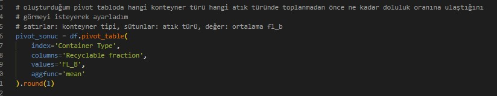

   Yukarıda görüldüğü üzere pivot tablom satır olarak kontenyer tipini sütunolarak ise atık türünü alıyor ve tablomu dolduracağım değer olarak da boşaltılmadan önceki değeri alıyor aynı zamanda bu depğeri kullanırken genel veri seti hakkında genl bir bilgiye sahip olmak istediğim için ortalamasını aldım.

   #### GÖRSEL OLARAK BİZE NE SAĞLADI
   
   Bu tablo bize görsel olarak karşılaştırmayı kolaylaştırdı tahmin ederek değil de gerçekçi bir tablo ortaya koyarak olayı gerçekçi ve tutarlı olarak gözler önüne serdi.

   #### PİVOT TABLOMUN GÖSTERİMİ
   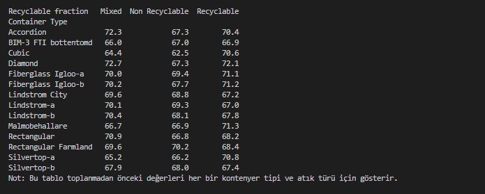

   Altına da kullanıcılar için açıklayıcı olsun diye bir not ksımı ekledim bu  not kısmında bu tablonun neyi ifade ettiğini net bir şekilde belirttim

## PREPROCESSING

Modelimi tasarlarken ilgilendiğim en önemli adım olan preprocessing kısmına geldiğimizde ise ;

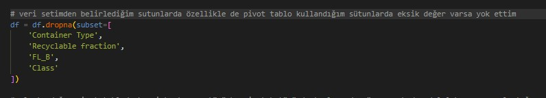

İlk olarak yukarıdaki gibi kullancağım sütunları belirledim ve bu sütunlardaki eksik değerleri yok ettim böylece hem modelini kullanırken hem de pivot tablomu oluştururken oluşabilecek kararsızlıkları,belirsizlikleri yok ettim.

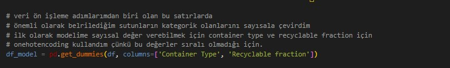

Preprocessing yaparken sütunlarımın tipine göre iki farklı yöntem kullandım buna da veri setimi inceleyerek karar verdim öncelikle neden bu iki değerimi one hot encoding ile ön işleme yapmak istememin sebebi değerleriminde biri kontenyer tipi ve diğeri ise atık tipi ikisi için de bir sürü değer söz konusu olduğundan ve eğer label encoder gibi 0 1 2 gibi değerler verirsem sayısı çok olan daha önemli gibi algılanmasını istemediğim ve modelimin daha sağlıklı tahminler üretebilmesi için bu yolu izledim

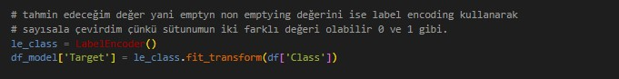

Yukarıda da bahsettiğim gibi kategorik verilerimi sayısallaştırrıken iki farklı yol kullandım ikincisi label encoder oldu tahmin edeceğim değer yani class sınıfımı label encoder kullanarak ön işlemesini tamamladım çünkü class sınıfımın iki dğeeri mevcut ki aynı zamanda  bu değer modelimin ana amacı toplanıp toplanmama durumunu gösteren bu değeri sayısallaştırdım.

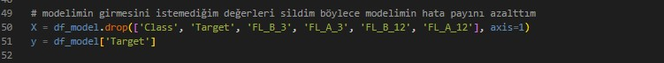

Buradaki kod satırlarında ise modelimin bakmasını istemediğim değerleri yoksaydım özellikle class ve target sınfıını buraya ekledim çünkü zaten class sınıfımın yeni adı yukarıda görebileceğiniz üzere yeni data frame ile target olmuştu o yüzden onu yok saydırmyı tercih ettim devamnda da target değişkenimi özellikle yok saymam gerekirdi çünkü eğer model sonucu görürse zaten baştan hata yapmış olurdum devamında da modelin bakıp kopya çekebileceği ileriye yönelik değerleri de buna ekledim.

Preprocessing adımlarımdan belki de olmazsa olmaz adımlarımdan biri olduğunu düşündüğüm yukarıdaki kod satırlarında ise modelimin tahmin yaparak ezberden kaçınıp gerçekten veriler üzerinden dorğu tahmin yapabilmesi için tasarladım %80 eğitim %20 test olarak belirlediğim ölçülerde modeli eğittim

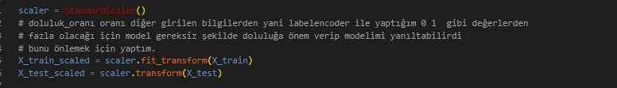

Burada ise yine modellerimi hatalı tahminlerden uzaklaştırmak için yine bir preprocessing kullandım burada modelimin tahmin ve test için kullanacağı değerleri scale ettim çünkü burada eğer scale edilmezse pivot tablomunda içini doldurduğum fl_b değeri yani boşaltılmadan önceki doluluk ben bu değeri modelimde çöp kutularının toplanması için gereken değer gibi yorumladım devamında bu bahsettiğim değer diğer değerlerin üzerine geçebilirdi çünkü sayısal olarak kategorik değelerimin sayısal halinden çok fazla olacağı için bu değerleri ezebilirdi ki ben bunu da modelimde hatalı yanıtlara yol açabileceiğini düşündüğüm için baştan hatayı önledim.

#### ekstra adımlar

Ben projemi tasarlarken öellikle farklılık olması adına kullanıcıdan değer alma adımlarını ekledim çünkü bir tahmin yapıalcaksa kullanıcıyı işin içine dahil etmek daha mantıklı olabilir gibi geldi.
Modelim tahmin yaparken kulalnıcıdan gelen isteklere göre tahmin yapacaktır kulllanıcıdan kontenyer tipi, atık tipi ve çöp kutusunun doluluk oranını istedim ve modelim bu aşamada gelen değerlere göre tahmin yaptı.
Böylece kullanıcı eğer bu kullanıcı bir kontenyer toplama şirketiyse doluluk oranalrını tiplerini, doluluk oranını girdikten sonra modelimizden çıkan karara göre ekip yönlendirebilir veya henüz toplama aşamasına gelmediyse yönelndirmez.
Modelimde 3 farklı çıktı aşması bulunmaktadır.Bunlar bekleme modu, takipinin gerekli olduğu yani 24 saat içinde dolabilceği veya acil toplanması gerektiği gibi değerlerdir.

Tüm aşamalarınnın try except bloğu içinde yaptığım kullanıcıdan değer aldıktan sonra da bir takım veri işelme adımları gerçekleştirdim:

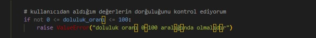

Bu adımda basit bir şekilde kulalnıcının absürt değerler (-1,500,-99..) gibi girmesini engelledim bunun için de raise error kullandım ki sistem çökmeden basit bir yazı ile sistem sonlansın.

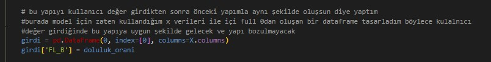

Bu adımlarda ise yorum satırlarında bahsettiğim gibi kullancııdan girdi aldığım için data frame yapısını korumam gerektiğini düşündüm eğer öncekş yapıyla uyuşmaz model hata verebilirdi bu yüzden de il olarak önceki frame yapımım içini 0larla doldurdum ve devamında da kulanıcıdan girdileri almaya hazır bşr hale geldi

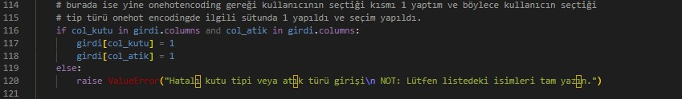

Bu kod satırlarında ise kullanıcıdan veri almadan önce bahsettiğim gibi onehot encoding uygulamıştım bazı sütunların üzerinde yine aynı duruma ithafen bu sefer de kullanıcıdan aldığım değere onehotencoder uyguladım daha doğrusu seçilen değerimi onehotencoder ile temsil edilebilmesini sağladım.
Öncelikle dorğu bir seçim yapıldığını kontrol ettikten sonra onehotencoderda ilgili sütuna 1 değerini yolladım böylece model bunun hangi seçim olduğunu bilecek ve tahmin yapabilecek.

Bu adımda ise yine daha önce yaptığım gibi gelen sayısal değeri scale ettim ki kategorik verilerden oluşan sayısal değerleri ezmesin diye.

## KARŞILAŞTIRILAN MODELLER

### MODELLERİ PROJEME NASIL DAHİL ETTİM

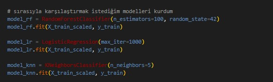

burada da görüldüğü üzere 3 farklı sınıflandırma modelini scale ettiğim x yapıları ile kurdum ki 3üde aynı şekilde eğitilsin  bu adımı böyle kurguladım.

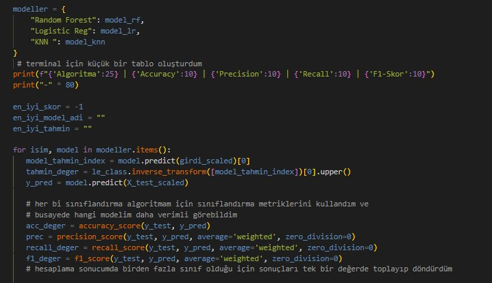

Buradaki uzun kod satırımda ise öncelikle pythonun önemli değişkenlerinden olan dict yapısını kulalnırsam daha kolay olaağını düşündüğüm bu sözlük yapısına oluşturduğum modelleri atadım ve devamında da bu modeller üzerinden tahmin işlemini yaptım.

  #### neden tahmin_deger hesaplaması
  Çünkü yukarıda modelin tahmin ettiği değerin indeksini aldım ve bu indeksi de gerçek bir tahmin değerine dönüştürmem gerekiyordu empty nonemptying gibi bunu ise bu satırda sağladım

  #### neden [0]
  Çünkü predict liste döner ve ben sadece bi değerle ilgilenmek istediğim için [0] kullandım

Devamında ise modellerim içim performans metrikleri çıktısını hazırladım burada metriklerimi her model için ayrı ayrı hesapladım ve böylece basit bir karşılaştırma ile ne iyi modelin en iyi tahminin ne olduğu kullanıcı karşısına çıkardım.

### MODEL KARŞILAŞTIRMASINDA KULLANDIĞIM METRİKLER

Ben projemi tasarlarken kullanacağım modeli belirlemeden önce target değişkenimi belirledim target değişkenim sayısal bir değer olmadığı ve çıktısı evet/hayır gibi empty/non-emptiyng olduğu için burada sınıflandırma algoritmaları kullandım.3 farklı sınıflandırma algoritması kullandım ve 3 nü de projeme uygulayıp doğruluk metriklerini hesapladım ve kullanıcı için nihai sonucu en yüksek verim gösteren yapı verecek şekilde tasarladım. 
Böylece hem kullanıcı hem de tasarımcı bu çıktıları görebilecek ve model karşılaştırmasını da yapabilecek. 

Kullandığım performans metrikleri ve açıklamaları devamında da çıktı ekranında nasıl gösterilidiği:

*ACCURACY SCORE* doğru tahmin sayısı / toplam tahmin sayısı olarak hesaplanan bir değerdir.
*PRECISION* model sınıf tahmin değerlerinde ne kadar başarılı.
*RECALL*  model doğru sınıflardan kaçını bilebildi.
*F1 SCORE*  üstteki iki metrikin ortası gibidir hem model doğru tahmin yapsın hem kaçırmasın dersek.

### MODEL KARŞILAŞTIRMA ÇIKTISI

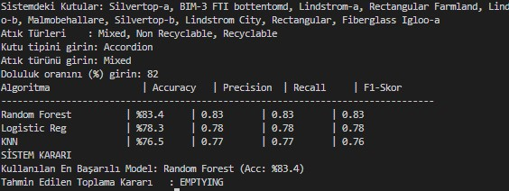

## KULLANICI İSTEĞİNE GÖRE MODEL SONUCU
Bu projemde kullanıcı için iki keran tasarladım.
### kullanıcı için terminal
Üstte de bahsettiğim gibi kullanıcı işlemine uygun bir terminal sistemi tasarlamaya çalıştım kullanıcı için ilk olarak kontenyer türlerinin ve atık türlerinin isimleri çıkaca ve devamında da kulalnıcı için bir input alanı oluşacak kullanıcı eğer hatalı girerse hata alacak ve program sonlanacak.
aşağıda terminalimin görseli bulunmaktadır.

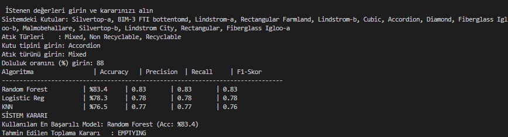

### kullanıcı için görsel arayüz
Bu kısmı yalnızca bu projenin geleceği olduğunu göstermek için tasarladım. Bu kodda her şey normal arayüzüm ile aynı işliyor modellerim ,performans metriklerim vs.
Tek farklılık thinkter ile çok basit bir gui ekranı hazırladım ve analiz ekranı için iki grafik ürettirdim.
Bu grafiklerden ilki performans metriklerinin sonucunu ekranda yansıtırken biri veri seti hakkında genel geçer bir bilgi olan target değerimin genel yoğunluğunu veriyor.

  #### gui amacı 
  Kullanıcı tek tek isimlere bakıp yazmak zorunda kalmasın basit bir liste yapısıyla istediği kontenyer türü ve atı ktürünü tek bir tık ile seçebilsin.

  #### gui görseli
  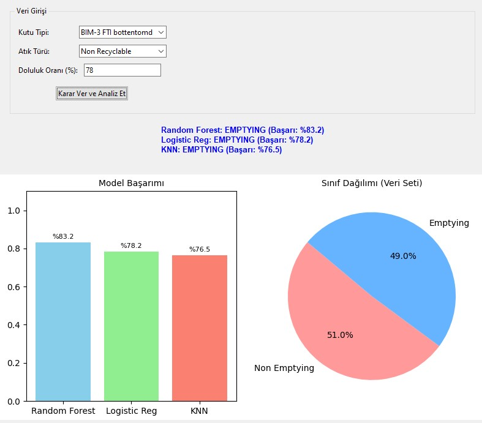
  
